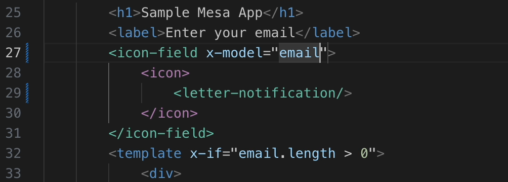

# 🚀 **Mesa VS Code Extension**  
**A companion extension for the Mesa build-time HTML component engine.**  

This extension provides **type completion** and **syntax highlighting** for Mesa components, making development with Mesa in Visual Studio Code even more productive and enjoyable. 

#### Known Issues:
The latest versions of the Vue VS Code extension may interfere with this extension. To resolve this, consider using an earlier version of the Vue VS Code extension.

---

### **New to Mesa?**  
Set up a minimal Vite website to test it out:  
```bash
npx @octamap/create-mesa@latest project-name
```

---

## **Features**

### Type Completion & Syntax Highlighting for:
- ✅ **Registered Components:**  
  Provides suggestions for components registered in your `vite.config.ts`. Start typing `<` and get a list of your components instantly.

- ✅ **Named Targets in Components:**  
  Offers type completions for named targets defined in your components.  
  **Example:**  
  If your component contains `<input #my-label>`, typing `<` inside the parent component will suggest `<my-label />`.

---

### **Example Syntax Preview**  


---

## **Requirements**

- None! This extension works seamlessly with your existing Mesa and Vite setup.

---

## **Release Notes**

### **1.0.0**
- Initial release of the Mesa VS Code extension.  
- Includes support for:
  - Component type completions.
  - Named target type completions.  
  - Syntax highlighting for Mesa components.

### **1.0.2**
- Improved code structure.
- Enhanced logic for identifying components.
- Added support for scenarios where Mesa is initialized like this: Mesa(() => { "comp": "./some/comp.html" })
  - This initialization method will be officially supported in the next Mesa version.
  - Using () => initializers enables detection of component additions or deletions during development (HMR).


### **1.0.3**
- More improvements to Mesa definition finder
  - Preperations for future Mesa versions
---

**Enjoy faster, smarter Mesa development with this extension!** 🚀